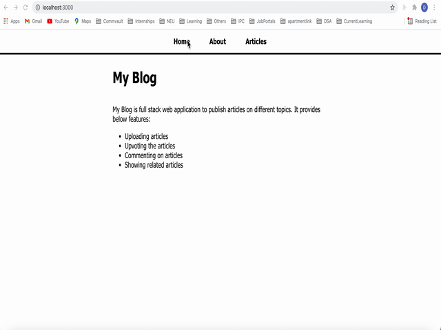

# My Blog

My Blog is full stack web application to publish articles on different topics. 
It provides below features:

* Uploading articles
* Upvoting the articles
* Commenting on articles
* Showing related articles

## Tech Stack
* HTML
* CSS
* Javascript
* React
* Express
* Node
* Express
* MongoDB

## How to run application
1. Navigate to the folder MyBlog/myBlogFrontEnd
* run ```npm install``` to install dependencies
* run ```npm start``` to run front end server
2. Navigate to the folder MyBlog/myBlogBackEnd
* run ```npm install``` to install dependencies
* run ```npm start``` to run backend server
3. Open terminal 
* run ```mongod``` to run mongodb server

## Demo

For Full Demo click [here](https://drive.google.com/file/d/1_Nhj6rPTxVP9g2iUyjRkZd7_Vp3qmlIO/view?usp=sharing)




